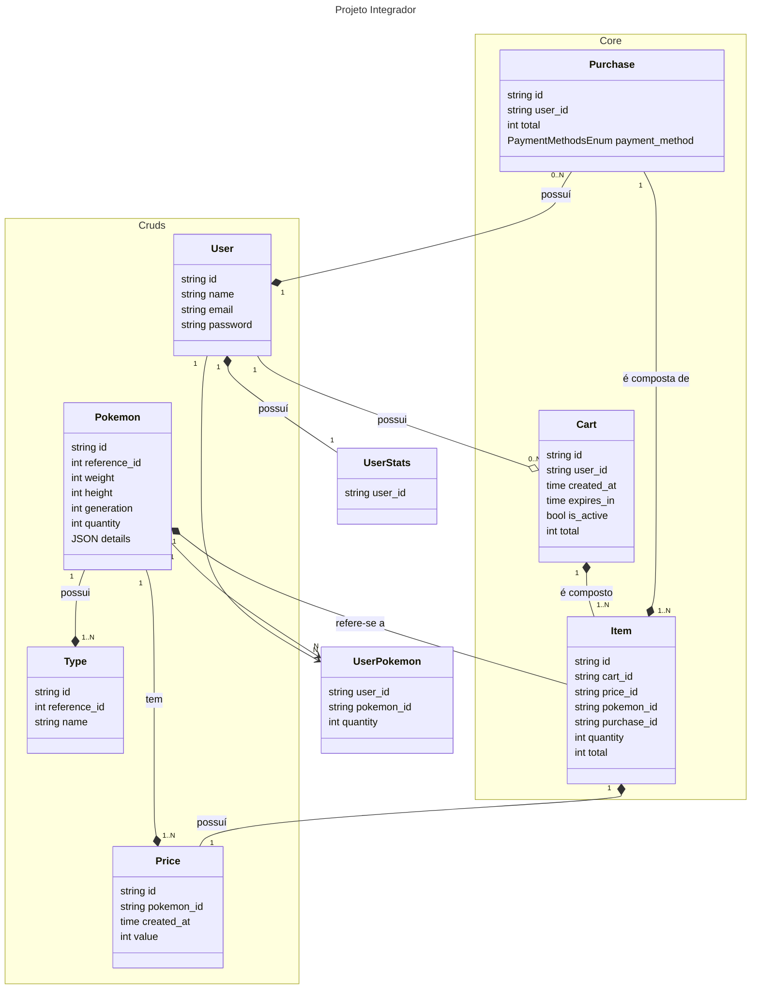

```mermaid
---
title: Projeto Integrador
---
classDiagram
    namespace Cruds {
        class User{
            string id
            string name
            string email        
            string password
        }

        class Pokemon{
            string id
            int reference_id
            int weight
            int height
            int generation 
            int quantity
            JSON details
        }

        class Type{
            string id
            int reference_id
            string name
        }

        class Price{
            string id
            string pokemon_id
            time created_at
            int value
        }
    }

    namespace Core {
        class Cart{
            string id
            string user_id
            time created_at
            time expires_in
            bool is_active
            int total
        }

        class Item{
            string id
            string cart_id
            string price_id
            string pokemon_id
            string purchase_id
            int quantity
            int total
        }

        class Purchase {
            string id
            string user_id
            int total
            PaymentMethodsEnum payment_method
        }
    }    

    class UserPokemon {
        string user_id
        string pokemon_id
        int quantity
    }

    class UserStats{
        string user_id
    }

    Pokemon "1" --* "1..N" Type : possui
    Pokemon "1" --* "1..N" Price : tem

    User "1" --o "0..N" Cart : possui
    Cart "1" *-- "1..N" Item : é composto
    Item "1" *-- "1" Price : possuí
    Pokemon "1" *-- Item : refere-se a
    Purchase "1" --* "1..N" Item : é composta de
    Purchase "0..N" --* "1" User : possuí

    User "1" --> "N" UserPokemon 
    Pokemon "1" --> "N" UserPokemon 

    User "1" *-- "1" UserStats : possuí   

```